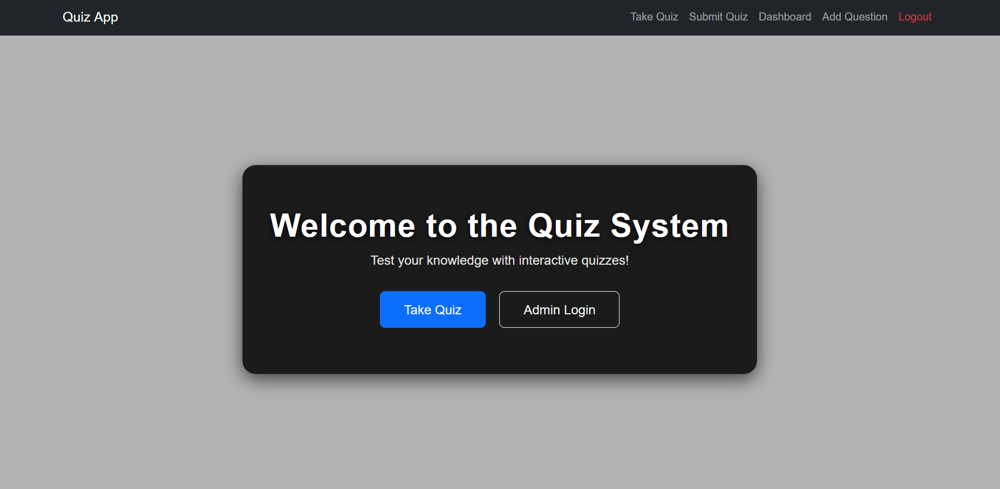
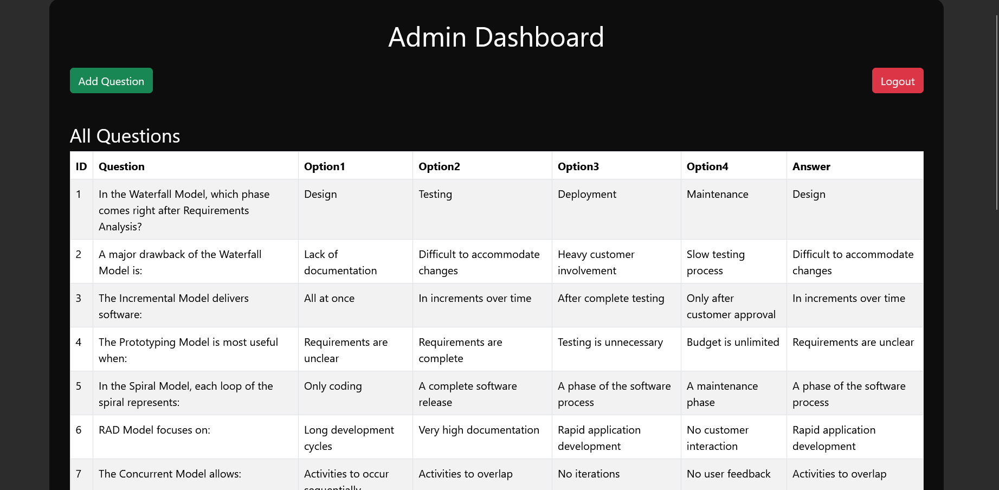
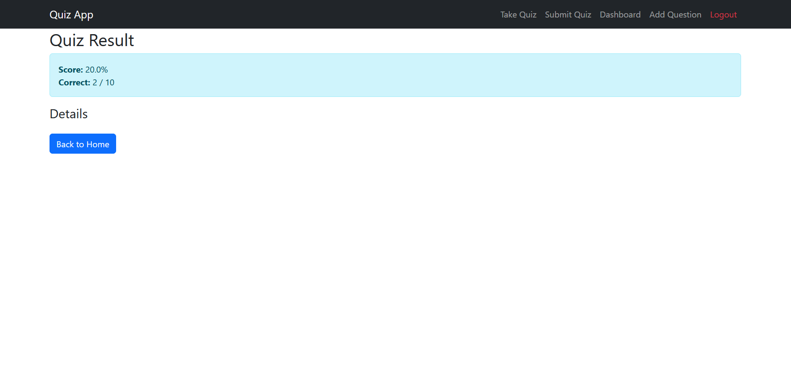

# 🎯 Quiz System Web Application

A web-based Quiz System built with Flask (Python) and SQLite, designed for users to take quizzes and for admins to manage questions. Includes a clean UI, admin panel, and result tracking.

## ⭐ Features

User-friendly and responsive quiz interface
Secure admin login
Add, edit, and delete quiz questions
View results with score summary
SQLite database integration
Bootstrap-powered modern UI

## 🖼️ Screenshots
### 🏠 Home Page


### 🔐 Admin Login


### 📊 Admin Dashboard


### 📝 Quiz Page


### 🏁 Quiz Result


## 🛠️ Technologies Used

1. **Backend:** Python, Flask  
2. **Frontend:** HTML, CSS, Bootstrap 5  
3. **Database:** SQLite  
4. **Other:** Werkzeug (for admin authentication)  


## ⚙️ Installation
1️⃣ Clone the Repository
```bash
git clone https://github.com/harshitarathor/quiz-system.git
cd quiz-system
```
2️⃣ Create Virtual Environment
```bash
python -m venv venv
```
3️⃣ Activate Virtual Environment

Windows:
```bash
venv\Scripts\activate
```
4️⃣ Install Dependencies
```bash
pip install -r requirements.txt
```

5️⃣ Initialize the Database

Run these two files to create tables and admin account:
```bash
python create_db.py
python create_admin.py
```
6️⃣ Start the Application
```bash
python app.py
```

Your app will run at:
```bash
http://127.0.0.1:5000
```

## 🚀 Usage

## 🔥 Features

### 👤 User Side
- Start quiz  
- Submit answers  
- View their score immediately  

### 🛡️ Admin Side
- Login using secure admin credentials  
- Add quiz questions  
- Delete or update existing questions  
- Manage full quiz content  

